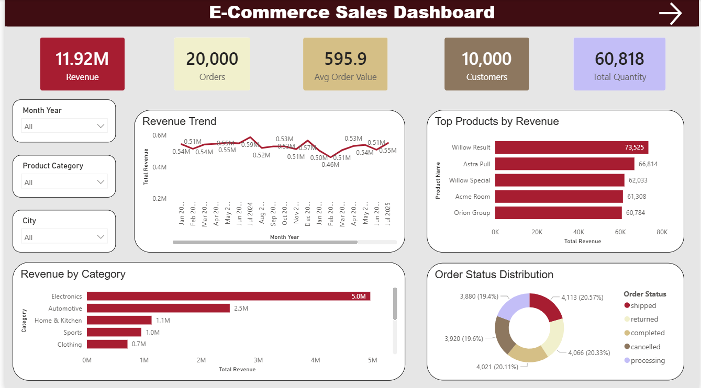
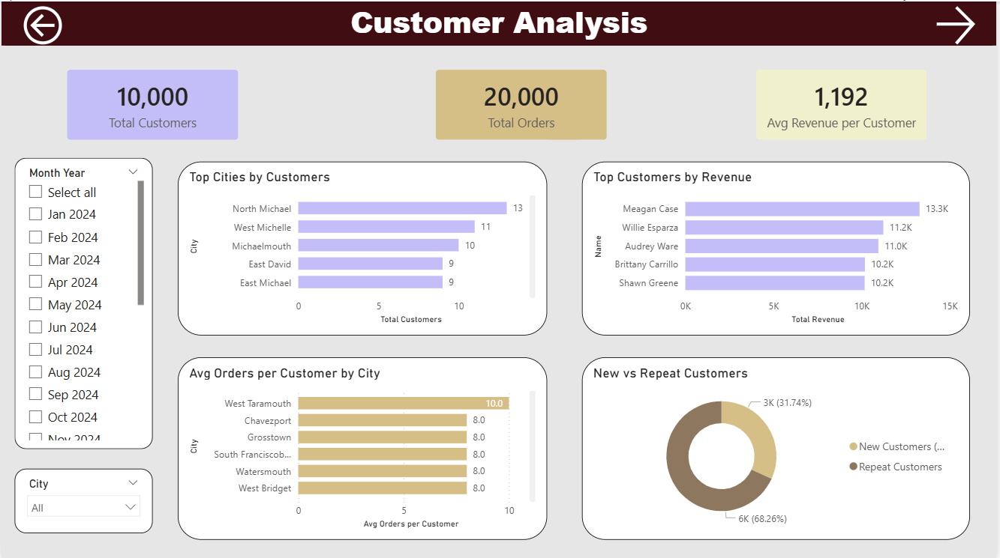
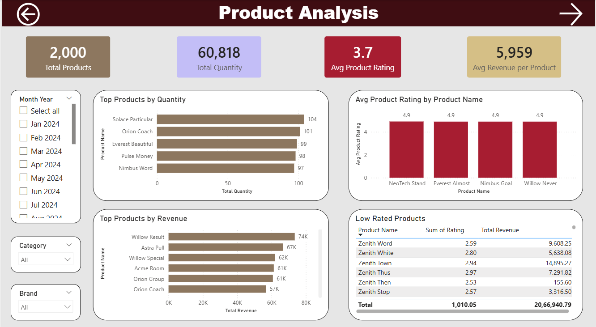
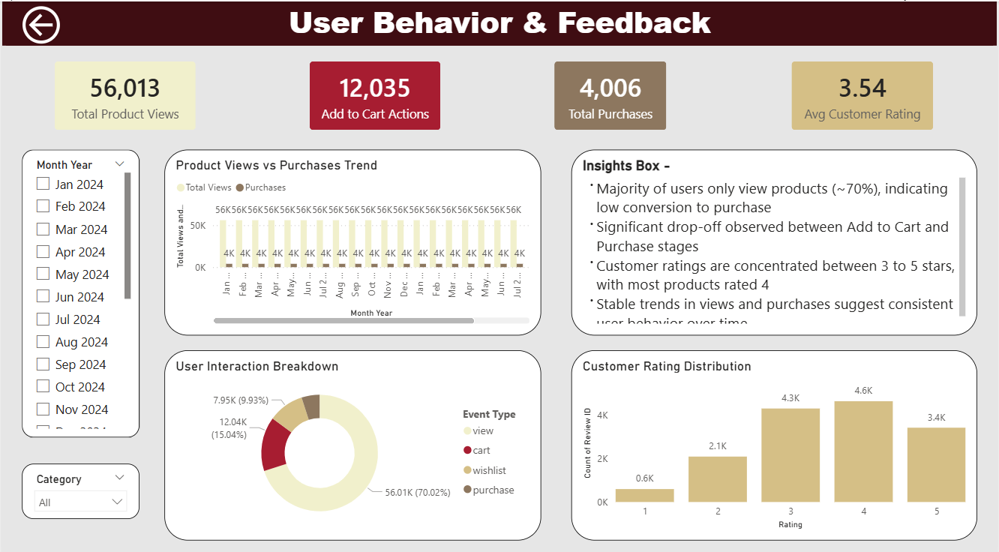

# E-Commerce Sales Analysis | Power BI

## Project Overview
An end-to-end data analysis project on a simulated e-commerce dataset consisting of 168,000+ records across 6 tables. The goal was to analyze sales performance, product trends, customer behavior, and user interactions to uncover actionable business insights through an interactive Power BI dashboard.

---

## Dashboard Pages
| Page | Description |
|------|-------------|
| Sales Overview | Revenue trends, category performance, order status distribution |
| Customer Insights | Customer segmentation, repeat vs new customers, top customers by revenue |
| Product Analysis | Product ratings, top products by revenue and quantity, low-rated products |
| User Behavior | Product views, cart additions, purchases funnel, customer rating distribution |

---

## Dataset
| File | Records | Description |
|------|---------|-------------|
| products.csv | 2,000 | Product details — name, category, brand, price, rating |
| users.csv | 10,000 | Customer details — name, city, gender, signup date |
| orders.csv | 20,000 | Order-level data — status, date, total amount |
| order_items.csv | 43,525 | Item-level data — quantity, price, product per order |
| reviews.csv | 15,000 | Customer reviews — rating, review text, date |
| events.csv | 80,000 | Behavioral events — view, cart, wishlist, purchase |

---

## Key Metrics
- **Total Revenue:** 11.92M
- **Total Orders:** 20,000
- **Total Customers:** 10,000
- **Average Order Value:** 595.9
- **Total Products:** 2,000
- **Total Events Tracked:** 80,000

---

## Key Insights

### Sales & Revenue
- Electronics is the top revenue-driving category at 5.0M, contributing ~42% of total revenue
- Automotive follows at 2.5M, while Groceries contributes less than 1% of total revenue
- Revenue trend remains relatively stable across Jan 2024 – Aug 2025

### Customer Behavior
- 68.26% of customers are repeat buyers, indicating strong loyalty
- Average revenue per customer stands at 1,192
- West Taramouth leads in avg orders per customer at 10.0

### User Funnel
- 56,013 product views → 12,035 cart additions → 4,006 purchases
- 8,029 carts remain unconverted, representing ~4.8M in potential revenue
- Cart abandonment rate stands at 66.7%

### Product Quality
- Average product rating is 3.7 out of 5
- 439 products are rated below 3.0
- Only 303 products are rated 4.5 and above

### Order Status
- 20.33% of orders were returned
- Orders are evenly distributed across shipped, completed, cancelled and processing statuses

---

## Tools Used
- **Power BI** — Data modelling, DAX measures, interactive dashboard design

---

## Business Recommendations
Based on the analysis, the following strategies are recommended to improve overall revenue:
1. **Cart Re-engagement** — Target 8,029 unconverted cart users through reminder emails and discount nudges to recover ~4.8M in potential revenue
2. **Electronics Expansion** — Increase inventory and visibility of Electronics category to capitalize on its 42% revenue dominance
3. **Product Quality Audit** — Review and improve 439 low-rated products to reduce 20.33% order return rate
4. **Wishlist Activation** — Convert 7,946 wishlist events into purchases through targeted offers
5. **Category Rebalancing** — Investigate underperforming categories like Groceries (>1% revenue) for repositioning or removal

---

## How to Use

1. Download the `.pbix` file from the repository
2. Open in Power BI Desktop
3. Use slicers to filter by Month, Category, Brand and City
4. Navigate across 4 pages — Sales, Customer, Product and User Behavior to explore insights

---

## Dashboard Preview

---

## Contact
Feel free to connect on [LinkedIn](https://www.linkedin.com/in/shreya-patil-cs/) or reach out for any feedback or collaboration.
